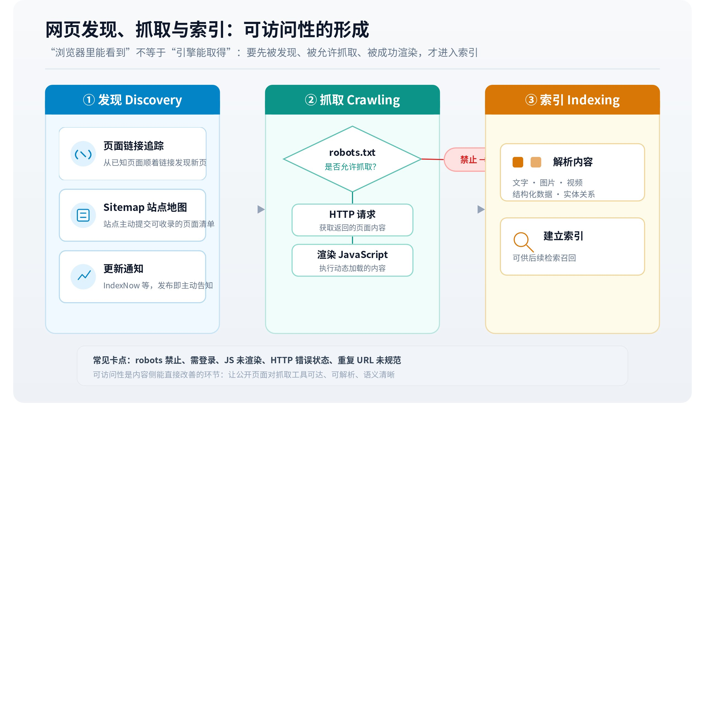

# 网页发现、抓取与索引：可访问性的形成

查询能够找到一篇网页，前提是相应服务知道它的存在，并且拥有可供查询的表示。[指定 URL 获取](https://larkcommunity.feishu.cn/wiki/KgWYwu2qhiOpWlkSeDWc2LSenHd)可以绕过部分发现过程，但仍需处理访问和正文获取。于是，“我在浏览器里能打开”只能说明一次访问成功，无法单独说明搜索服务和生成式工具也获得了相同内容。

*▲ 机制图解；可交互完整版见[飞书知识库原文](https://larkcommunity.feishu.cn/wiki/EUjmwxHW8iJLxNkgDuIc6Qh7njd)。*

## 一、发现、抓取和索引分别做什么

发现阶段取得 URL，入口可能是站点链接、站点地图或其他提交渠道。抓取阶段向服务器请求资源，取得响应内容。索引阶段处理资料，形成支持查询的表示，并可能识别重复页面、正文主题和其他属性。Google 官方将抓取、索引、提供结果分开说明，并指出网页不一定完成每个阶段。[搜索工作原理](https://developers.google.com/search/docs/fundamentals/how-search-works)

这几个阶段具有不同失败方式。没有发现 URL，属于入口问题；发现后收到拒绝或超时，属于获取问题；正文取得却没有纳入索引，涉及后续处理和选择。最终搜索不到网页，不能仅凭结果确定失败发生在哪里。

一个新页面在直接访问时成功，但尚未出现在搜索中，是逻辑上完全可能的状态。反过来，搜索中仍有旧标题，也不保证当前页面可以正常获取。索引记录与源站响应之间存在时间差。

## 二、页面响应与浏览器显示可能不同

网页可以在初始 HTML 中包含正文，也可以依赖 JavaScript 请求数据后显示。浏览器会执行脚本、加载资源并使用登录状态；某个抓取工具可能只处理初始响应。两者看到的内容因此可能不同。

Google 的 JavaScript 搜索说明描述了抓取、渲染与索引过程，并提示渲染和资源访问存在实际限制。[JavaScript SEO 基础](https://developers.google.com/search/docs/crawling-indexing/javascript/javascript-seo-basics)能够渲染 JavaScript 的搜索服务，也不能代表所有 AI 工具都有相同能力。判断时应核对目标工具实际取得的正文。

例如，页面初始响应只有应用框架，产品参数通过登录后的接口加载。工具可能拿到导航和按钮，用户却在浏览器中看到完整参数。问题来自资源交付方式及权限，不宜解释为模型“不愿意读”。图片中的参数、视频中的说明和折叠区域内的异步内容，也需要额外处理。

### HTTP 成功不等于正文成功

请求资源时，服务器返回状态码和响应内容。状态码描述请求在协议层面的结果，正文是否完整、可理解，还要继续检查。一个页面返回成功状态，内容却只有“请登录”或空白框架，工具仍没有取得目标材料。Google 的状态码说明也明确指出，成功响应不保证索引收录。[HTTP 状态与抓取](https://developers.google.com/crawling/docs/troubleshooting/http-status-codes)

重定向会让请求从旧地址转向新地址。迁移、地区分流或登录跳转都可能产生这种行为，最终取得的页面未必就是用户最初想到的内容。若工具只记录最初 URL、不记录最终地址，来源核验就可能混淆。失效地址、权限拒绝、请求限流和服务端故障，也各有不同含义：一次限流不能证明页面永久关闭，一次成功不能证明长期稳定可用。

还要区分传输完整与语义完整。服务器可能成功返回文章上半部分，其余内容需要继续分页；一份 PDF 可以下载成功，却有扫描页无法提取；一个图表的图片能加载，但工具只返回了替代文字。对内容使用而言，关键问题是决定结论的那部分信息是否真正到达，而不只是请求有没有报错。

## 三、抓取规则、索引控制与身份认证

robots.txt 用于向遵守该协议的爬虫表达抓取规则。它不能代替身份认证；不允许抓取，也不必然保证 URL 完全不出现在搜索结果中。Google 文档明确区分抓取控制和索引移除。[robots.txt 说明](https://developers.google.com/search/docs/crawling-indexing/robots/intro)

索引控制还涉及页面或响应头中的指令。系统要读取相关指令，通常需要能够获取相应资源，因此抓取限制与索引指令之间可能存在交互。真正的私有资料应依靠访问控制，而非仅靠要求爬虫不访问。

不同机器人可能承担训练抓取、搜索索引或用户触发访问等不同任务。控制一个代理名称，不等于控制全部信息路径；执行策略还应参考对应服务的公开说明。不能将某个用户触发抓取的结果，推广为该站点对所有爬虫都开放。

### 访问身份怎样改变返回内容

同一个 URL 在不同请求条件下，可能返回不同语言、地区价格、账户套餐或实验界面。浏览器携带的登录信息、地区设置和历史状态，都可能改变页面内容。搜索抓取通常不会拥有某个普通用户的完整状态，用户触发工具也未必继承浏览器身份。因此，复现访问问题需要记录返回页面的实际内容，不能只对照网址是否相同。

例如，用户在已登录的企业账户里看到完整产品手册，公共访问者只看到介绍页。这并非页面不存在，也未必是工具解析失败。访问层已经依据身份返回不同资料。如果将登录后截图中的内容当作所有外部系统均可取得的公开信息，就会错误估计传播和检索范围。

反过来，公开摘要中可能已经包含关键事实，系统即使没有登录，也能依据摘要给出部分回答。此时应区分“回答中出现某项事实”与“系统读取了受限原文”。未经过程证据，不能因为答案正确，就推断平台绕过权限或拥有特殊合作入口。

## 四、重复 URL 与规范页面

相同内容可能存在于带参数地址、打印版、移动版或转载页。搜索系统需要决定怎样聚合这些表示，避免将同一内容重复展示。规范化 URL 的声明可以提供线索，实际选择仍取决于系统对多种信号的处理。Google 的规范网址文档说明了相关机制与方法。[规范 URL](https://developers.google.com/search/docs/crawling-indexing/consolidate-duplicate-urls)

这也解释了为什么搜索或引用有时显示另一个地址。可能涉及规范化、跳转或来源归属，不能立即认定系统没有读取原内容。另一方面，不同版本若被错误聚合，用户需要的旧版或地区信息可能不易找到。规范化解决重复，并不意味着所有相似页面都应该合并。

### 版本页与重复页的边界

旧版文档、新版文档和地区版文档可能大部分相同，却包含少量决定性差异。去重或规范化若将它们过度合并，搜索结果中只保留一种表示，就可能使历史问题或地区问题失去恰当入口。页面设计应使版本和适用范围可辨认，但外部系统最终如何聚合，仍需要实际观察。

带追踪参数的同一正文通常不增加独立事实，独立版本页则可能承载不同事实。两者不能只按 URL 数量区分。引用系统若展示规范地址，还需要确认它对应的内容版本是否支持答案；一个今天指向最新版的通用链接，可能已经无法复现去年回答所依据的旧说明。

站点地图和结构化标记也属于信息线索。站点地图帮助发现 URL，结构化数据帮助表达实体与属性；它们本身不保证进入答案。Google 的结构化数据文档说明了相关展示资格与限制，不能将某项标记直接解读为对生成式引用的承诺。[结构化数据说明](https://developers.google.com/search/docs/appearance/structured-data/intro-structured-data)页面正文、标记内容与真实对象之间仍需一致。

## 五、内容平台的可访问性需要逐层判断

公众号、社区、短视频和文档平台不能只按名称分成“能读”或“不能读”。同一平台可能同时存在公开网页、仅登录可见内容、分享页面摘要及授权接口；搜索服务还可能通过不同的数据合作或访问路径取得材料。能否访问，需要落实到具体页面、工具、身份与时间。

浏览器中的分享链接成功，证明了当前身份的访问能力。搜索结果中出现摘要，证明服务拥有某种可用记录。工具取得全文，才进一步证明该次请求获得了正文。三种观察支持的结论不同。

访问条件也可能变化，单次失败可能是超时、限流或临时响应；反复失败需要保留状态与返回内容，才能缩小原因。这里的专业判断应建立在可见证据上，避免为每个平台编造一条永久不变的可访问性规则。

### 公开内容与结构化入口的配合

一个站点可能同时提供面向读者的页面、可下载文件和面向程序的数据接口。三种入口不必包含完全相同的信息：网页便于解释背景，表格文件便于保留批量数据，接口便于按字段和版本查询。外部应用具体使用哪一个，会改变获取成本及能够保留的结构。

例如，产品页展示“多个地区可用”，地区清单放在下载文件中，实时库存则通过另一个接口查询。搜索抓取网页可能只能确认一般可用性，无法直接回答某地区此刻是否有货。应用若没有相应接口权限或工具，就需要保留这个信息缺口。公开页面中的概括无法代替实时业务状态。

这也解释了公开内容优化与数据接入的不同边界。让网页更清晰可以改善可读材料，无法自动开放一个未授权接口；提供结构化接口可以增加获取能力，但需要客户端实际接入。两条路径可能互补，不能将其中一项当成另一项已经完成的证据。

处理格式时还应保留信息一致性。网页写支持某版本，下载文件仍是旧版，接口返回另一个地区的配置，系统会面对真实的数据冲突。来源内部一致要求对象、属性和条件能够对齐，各渠道可以采用适合自身形式的表述。不同入口有各自更新时间时，应让这些时间差可辨认。

## 六、从公共页面到可用证据的完整例子

假设一家设备厂商发布新版说明，地址可以在浏览器中打开。页面顶部写“支持无线连接”，底部脚注限定为专业版。初始 HTML 只有标题，参数表由脚本加载，脚注又位于折叠区域。不同获取路径可能形成几种结果：搜索服务发现 URL 但没有渲染出参数；摘要只保留标题；正文提取器拿到参数表却删掉脚注；完整浏览器渲染则能看到全部内容。

四种状态对最终回答的影响不同。未取得参数时，系统可能退回旧资料；取得标题时，可能知道新增无线功能却不知道版本；脚注遗漏时，可能错误推广到全系列；完整获取后，才具有准确区分版本所需的输入。即使最后仍回答错误，也可以将调查重点从获取移向上下文使用和生成。

这类分析需要沿信息流检查，而非先猜测“网站权重不足”。公开页面能打开只是第一项证据；目标工具是否获得完整正文，搜索服务是否拥有可检索表示，查询是否返回它，是后续分别需要确认的事实。在没有相应过程信息的公开产品中，可以保留多个可能原因，避免把不可见环节写成确定结论。

## 七、抓取频率和资源预算为何重要

互联网内容量远大于任意一次请求能够处理的范围。搜索服务需要决定何时重新访问哪些资源，站点也需要承受相应请求。页面更新后，源站内容与搜索表示出现短暂差异，在机制上并不反常；若错误、重定向链或大量重复地址增加处理负担，问题还可能持续更久。不同服务的调度规则有差异，不能用一个固定小时数解释所有更新。

对单次用户触发的读取，时间预算同样存在。工具可能在某个时限内等待脚本、下载文档或处理页面，超过预算后返回部分内容或失败。篇幅很大的资源、复杂页面和不稳定服务器，因此可能产生与简洁静态正文不同的处理结果。这里讨论的是交付和处理成本，不等于短内容天然比长内容更值得引用。

更新时滞会在第十三篇专门展开。本篇需要保留的区分是：没有访问、访问失败、访问部分成功、完整访问但没有索引、索引存在但本次未被检索，分别是不同状态。把它们统称为“AI 看不见”，会让后续判断失去必要的分辨率。

访问判断也应区分资源与站点。首页可读，不能保证附件、分页、子域名和下载链接采用相同规则；正文可读，也不能保证图片中的说明已被取得。对一个技术结论而言，关键资源可能藏在附表或版本公告中。核对具体证据入口，比只测试首页更能说明资料是否真正可用。

## 八、可访问性结论需要多细的证据

一个可靠的描述应能回答：哪个页面，在什么时间，由什么入口，以什么身份，返回了什么内容。它可以很具体，例如“公开分享页返回标题与摘要，登录后的浏览器显示全文”；也可以保留未知，例如“结果中存在来源链接，但未取得本次正文读取记录”。这样的描述比给整个平台贴上能读或不能读的标签更持久。

技术能力和使用许可也需要分别理解。某种内容在技术上可以取得，不代表所有使用方式都得到授权；文档允许某类访问，也不保证某次工具调用一定成功。机制分析聚焦已公开能力与实际响应，在这些证据上建立判断，才能与后续的解析和权限讨论衔接。

网页成功取得之后，还要转成可用材料。接下来的[解析与分块](https://larkcommunity.feishu.cn/wiki/To5TwIwZUisCKmkzm6kcI9x0nRb)，正是从“有内容”到“能被准确使用”的关键转换。

---

*本页同步自 OpenGEO 飞书知识库 · [飞书原文](https://larkcommunity.feishu.cn/wiki/EUjmwxHW8iJLxNkgDuIc6Qh7njd) · 内容以 [CC BY 4.0](https://creativecommons.org/licenses/by/4.0/deed.zh) 开放授权。*
