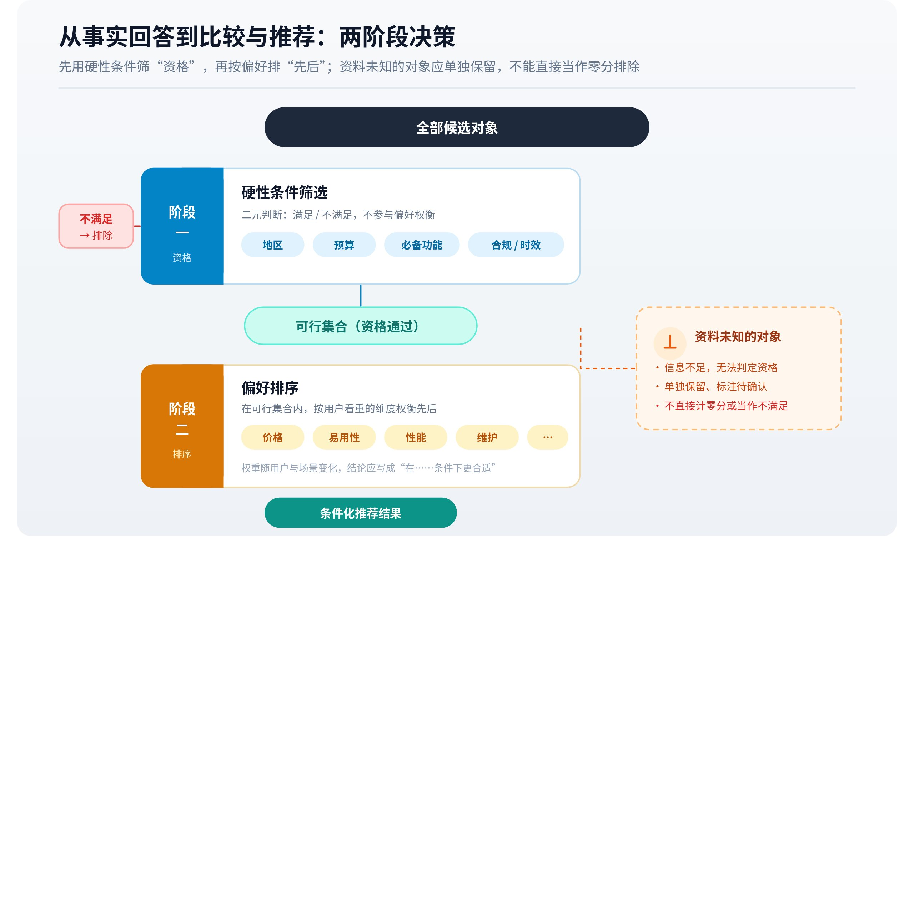

# 从事实回答到比较与推荐

准确介绍产品与建议用户选择产品，包含不同的判断。前者主要核对属性，后者还需要把属性与需求关联，处理约束、偏好和未知信息。因此，[来源被引用](https://larkcommunity.feishu.cn/wiki/AW1gw1T87ioJsIk5kj0cZ07On1e)不能直接等同于对象获得推荐，更不能视为交易已经受到同等程度影响。

## 一、推荐先受到候选集合限制

系统只能比较当前认为值得考虑的对象。候选可能来自搜索、产品目录、参数知识或用户明确给出的名单。候选集合不同，即使后续评价标准相同，也可能得出不同首选。

假设用户比较三个已知产品，系统可以围绕这三者查找能力与价格；用户只问“有哪些合适的方案”，系统还需要先发现候选。前一种任务中的表现，不能完整代表非指名发现能力。将两类问题混合计分，会掩盖这个结构差异。

E-GEO 使用电商查询及配套商品候选研究生成式推荐中的内容优化。[E-GEO](https://arxiv.org/abs/2511.20867)这类实验能研究给定候选中的选择，但其设置与全网发现、库存更新及交易流程仍有差别，不能直接推导为所有购物助手的完整机制。

### 发现候选与评价候选的两种任务

用户明确给出三个品牌时，问题主要在于比较这些对象；用户只描述需求时，系统还要决定考虑哪些对象。前者的实验能让某个文案影响选择，却无法证明该文案能够帮助产品从全网被发现。两类任务共享后续处理，但上游的信息条件差别很大。

候选集合还可能来自商业目录、库存系统或地区服务名单。目录中不存在的对象，即使互联网上有良好资料，也可能无法进入该入口的选择。某个推荐助手只服务特定商品集合时，其“最佳选择”应理解为集合内判断。是否覆盖整个市场，需要额外证据。

资料丰富程度也会影响可比性。一款产品提供完整规格，另一款只有宣传语，系统对后者可能保留未知。如果评价规则偏向已确认属性，资料缺口会影响候选结果；这不等于未知属性在现实中一定差。比较应该让读者看见信息不对称，避免把证据覆盖直接包装为能力排序。

## 二、硬性条件与偏好需要分开

硬性条件决定是否有资格成为方案，偏好影响合格候选之间的顺序。比如必须支持某地区服务，属于可行性条件；更便宜、更易上手则可能属于权衡。系统如果用一个优点抵消不可缺少的能力，就会推荐不适用产品。

自然语言中，两者未必明确。用户说“最好支持离线”，可能表达强偏好，也可能实际无法接受联网依赖。系统需要结合上下文澄清或解释假设。未经确认就固定偏好权重，会把主观选择包装成客观排名。

多条件之间还可能冲突。最低成本、最强性能、最少维护未必由同一个方案同时满足。专业回答应说明取舍，或按不同使用情形给出选择，而非无依据地产生一个适合所有人的第一名。

### 可行集合与偏好排序可以分两步理解

设用户必须在无外网环境中编辑文件，且年预算不超过两万元。可行性判断先检查这些条件，任何一项明确不满足都可能排除候选。在剩余对象中，易用性、扩展性和维护工作量再参与权衡。如果先把所有指标加总，极低价格可能在分数上抵消离线编辑缺失，但在用户任务中这种补偿毫无意义。

未知状态需要单独保留。某个产品没有公开离线编辑说明，不能确认合格，也不能确认不合格。系统可以要求补充资料、给出待确认名单，或在最终建议中明确条件。把未知自动视为零分，会系统性惩罚公开信息少的对象；自动视为满足，则可能给用户制造实际风险。

偏好还可能随用途变化。临时小项目重视上手快，长期部署重视维护和迁移，预算相同也可能有不同选择。一个统一的总分若没有解释权重来自哪里，会把应用默认偏好写成用户偏好。条件化建议通常更容易核对：在哪种需求下选择哪一个，主要放弃了什么。

*▲ 机制图解；可交互完整版见[飞书知识库原文](https://larkcommunity.feishu.cn/wiki/DLsRw2kldiyRS8kBXm1cttU8nVd)。*

## 三、比较怎样把证据变成判断

比较需要可比口径。月费按账号还是按团队计价，性能测量是否使用相同负载，功能是否属于同一版本，都影响结论。两个数字能够放在同一张表里，并不意味着它们具有相同含义。

材料缺失也不能当成能力缺失。某产品公开资料未说明某功能，合理状态是未知或待确认；直接写成“不支持”，会把证据覆盖差异变成产品优劣。另一方面，宣传材料没有列出限制，也不能据此假定完全没有限制。

“优于”通常还包含评价准则。启动更快可能有利于短任务，持续吞吐更高可能有利于长任务。如果来源只测一个维度，答案应保持该维度，不能扩大成综合领先。

### 比较表需要统一单位和适用条件

假设甲软件每人每月收费，乙软件按团队年付，丙软件一次性购买但维护另计。直接把三个公开数字放在一列，会给出错误的价格直觉。要计算可比成本，需要固定人数、使用年限、付款方式、必要附加服务和迁移费用。若某项数据不可得，应保留空缺或范围，不宜补出看似精确的总价。

性能比较也需要对齐任务。小文件延迟、大批量吞吐和峰值并发分别描述不同能力；单机测试与集群测试无法只按数字大小比较。产品介绍写“更快”，只有在测试条件与用户负载有关时，才可能构成推荐依据。来源支持某一维度的优势，答案就应保持这个维度。

多目标选择可能存在多个合理方案。甲更便宜、乙更省维护，在用户没有明确取舍时，两者未必能排出唯一先后。一个对象若在所有关心维度都不差且至少一项更好，可以构成较清楚的支配关系；现实比较常缺少这种情况。说明取舍与条件，比凭模糊形容词给出综合冠军更有信息价值。

## 四、生成模型的比较不等于稳定评分函数

语言模型可以根据描述作出比较，也可能受到候选顺序、表达方式及上下文影响。关于模型评价偏差的研究在其任务中发现了位置因素的影响。[评价偏差研究](https://arxiv.org/abs/2305.17926)该结果提醒我们控制实验输入，不能直接把某产品一次排第一解释为稳定偏好。

也不应从推荐名单反推一个具体权重公式。平台可能使用专门排序、规则过滤、业务数据及生成式解释，外部仅看到最终文字。若没有公开架构或过程数据，“权威度占多少、内容长度占多少”之类数值属于猜测。

改变文案后推荐变化，可以成为观察线索；若候选、查询、价格和平台版本也变化，就难以将全部效果归给文案。受控实验能识别局部因素，真实环境测试用于判断迁移，两者需要结合。

## 五、推荐之后还有业务链路

推荐可能带来理解、收藏、搜索或咨询，也可能直接满足用户的信息需求而没有点击。点击之后还涉及可用性、价格、注册和销售过程。因此，回答中的推荐、访问行为与成交是不同层级的结果。

这一区分也决定了合理的反向评价。在不适用问题中准确排除产品，是回答质量的改善；它可能降低推荐次数，却减少错误咨询和误购。仅追求所有问题中的提及与首位推荐，会使评价偏离实际需求。

理解推荐机制后，可以把观测拆成候选覆盖、条件满足、事实正确、比较口径和推荐语境。这样既能识别产品未进入考虑范围，也能发现已经进入名单却被错误描述的问题。后一种情况需要的证据与修正路径，和前一种并不相同。

## 六、推荐理由与实际选择依据可能不完全相同

生成模型很擅长为一个选择组织通顺的理由，但最终解释不必然完整展示内部选择过程。对象可能先由某个候选规则或排序服务确定，再由模型撰写说明。即便所有处理在一个模型调用中完成，事后语言解释也不能直接视为对内部因果过程的准确记录。

这一区别影响研究方法。让模型回答“为什么推荐甲”，可以得到它给出的理由；要判断某个属性是否真的决定选择，需要在控制其他条件时改变该属性，观察选择怎样变化。如果同时改变名称、价格和描述，就无法只归因于其中一项。

推荐理由本身仍然可以核验。它是否引用真实属性，是否符合用户约束，是否遗漏决定性限制，属于可观察质量。内部决策原因未知，不妨碍评价解释是否诚实、有据和适用。应避免用“模型说自己喜欢某格式”作为稳定机制结论。

## 七、知名度与反馈循环怎样影响候选环境

推荐系统研究长期关注流行度偏差：受到更多曝光的对象可能积累更多互动，互动又可能被系统用作后续推荐信号，从而强化已有差异。[流行度偏差综述](https://arxiv.org/abs/2308.01118)这提供了理解反馈循环的理论背景，但不能直接证明某个生成式聊天产品使用了相同反馈机制。

在生成式搜索中，还可能存在另一种信息层面的循环：常被讨论的产品拥有更多可检索材料，更多回答又可能促使人们继续讨论它。要证明循环实际发生并测量强度，需要时间序列、来源变化和行为数据，单次推荐不足以确认。品牌知名度、资料覆盖和任务适用性也需要分别观察。

对新产品而言，缺少历史信息会使公开证据较薄，但准确的现有资料仍有助于回答具体问题。机制分析应关注哪些必要属性缺失、哪些使用条件尚不可验证，避免将一切归结为“品牌不够大”。这类缺口可以具体识别，笼统的知名度解释却难以检验。

## 八、一个完整的条件化推荐例子

假设用户要求十人团队在封闭网络中编辑文档，预算两万元，现有资料显示甲只能离线查看，乙支持本地编辑且费用在预算内，丙功能满足但报价未公开。甲应因关键能力不满足而排除；乙可以成为有据候选；丙应保留为需要报价确认的选项。这个结论不需要发明一套通用权重，只需明确任务约束与证据状态。

如果用户随后说明可以接受部分联网，甲重新进入可行集合，比较结果改变是合理的。若乙更新价格超过预算，也需要重新判断。推荐因此是对象、证据、时间和用户条件共同决定的结果，不能永久绑定在某个品牌上。

假如答案只因为甲知名就推荐甲，错误可以明确定位为约束未被遵守；如果把丙未报价写成价格昂贵，错误在未知状态被错误转换。通过这种具体拆解，能够比笼统地讨论“推荐偏好”更清楚地解释答案质量。

### 选择对哪些条件敏感

一个推荐是否稳健，可以看合理范围内的小变化是否会改变结论。若甲与乙的成本非常接近，预算估计稍有变化就可能交换次序；若甲明确缺少必须功能，则小幅价格调整通常不应改变排除结果。这种敏感性来自决策结构，无法用一个固定品牌排名完整表达。

比较时可以明确几个关键条件：团队人数增加后，按账号计费方案是否仍在预算内；使用年限延长后，一次性采购与订阅的总成本关系如何变化；维护资源不足时，原先性能更高的方案是否仍可行。这些分析建立在公开属性与明确假设上，不需要虚构用户偏好概率。

信息缺口也会影响稳健性。丙的报价未知，若它低于某个范围便有竞争力，高于该范围则不适合，可以据此说明下一步需要确认的内容。与直接将丙排最后相比，这种条件化判断更忠实地表达当前证据。它也帮助读者区分“产品差”与“资料不足以完成选择”。

推荐理由如果在条件变化后完全不变，应检查系统是否真正使用了用户需求；若一个无关措辞变化就让事实结论翻转，则需要检查生成稳定性。合理敏感与无关敏感是两种现象。前者反映对任务条件的响应，后者可能暴露输入表示、排序或生成中的不稳定。

## 九、推荐评价应同时考虑适用与准确

品牌出现率能够描述可见性，却不能衡量推荐是否帮助用户。较完整的评价还要检查候选是否满足条件、属性是否正确、比较是否公平、未知是否说明、理由是否支持选择。必要时还需要观察后续咨询或使用结果，但这些业务数据与回答机制分属不同证据层级。

一次准确排除不适用产品，可以提升回答质量，即使减少该品牌的推荐次数。以所有问题中都被推荐为目标，会鼓励忽略适用边界。专业知识库应解释何时有依据推荐、何时应保留条件，让可见性与真实任务价值保持联系。

---

*本页同步自 OpenGEO 飞书知识库 · [飞书原文](https://larkcommunity.feishu.cn/wiki/DLsRw2kldiyRS8kBXm1cttU8nVd) · 内容以 [CC BY 4.0](https://creativecommons.org/licenses/by/4.0/deed.zh) 开放授权。*
