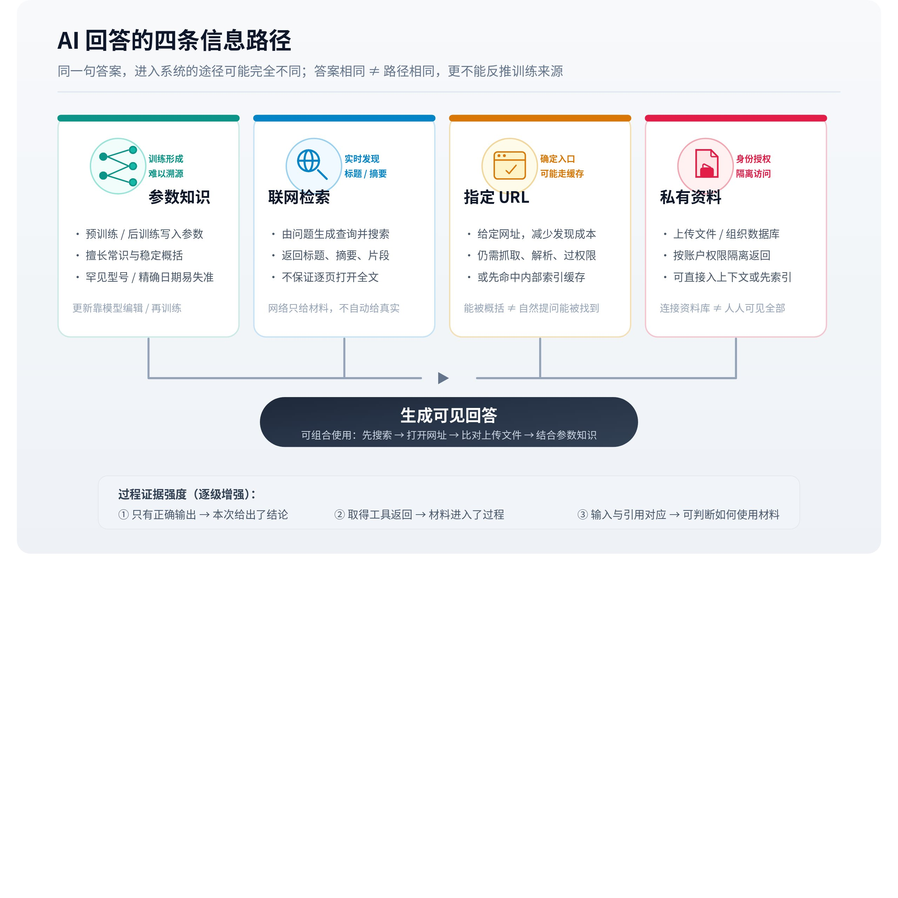

# AI 回答的信息来源：参数知识与外部信息

理论层已经把资料获取、回答采用与准确呈现分开。进入机制层，首先要确认一个更基础的问题：当前回答中的信息，是通过什么途径进入系统的？同一句正确答案，可能来自模型已有知识、搜索结果、指定网页，也可能来自用户上传的文件。答案相同，不代表信息路径相同，更不能据此反推某个页面已经进入训练数据。

*▲ 机制图解；可交互完整版见[飞书知识库原文](https://larkcommunity.feishu.cn/wiki/KgWYwu2qhiOpWlkSeDWc2LSenHd)。*

## 一、参数知识：训练形成的能力与关联

模型训练会调整参数，使模型学会语言结构、概念关系及部分事实。推理时，模型根据输入和这些参数生成后续内容。参数知识可以支持回答常识或概括某个领域，但通常不提供一张可以按答案反查的原始网页清单。能够复述某句话，也不足以确认其唯一训练来源。[RAG 原始论文](https://arxiv.org/abs/2005.11401)正是从参数知识难以更新和说明出处等问题出发，引入外部检索材料。

参数承载的是训练形成的计算关系。把模型比作存着所有网页的数据库，会产生两个误解：第一，认为更新官网后，模型内部马上同步；第二，认为模型说出品牌，就证明它读过当前官网。网页变化和模型参数更新属于不同过程。部署中的系统还可能更换模型、采用后训练或增加工具，因此单凭一个“知识截止日期”也无法解释产品的全部信息能力。

例如，一款设备在旧资料中只有有线版本，后来增加无线版本。没有外部信息时，模型可能继续给出旧介绍；提供新说明后，它也可能在这次回答中正确描述无线能力。后一个结果证明新说明在当前上下文中可能发挥了作用，无法单独证明模型已经永久记住新版本。

### 参数中的关联怎样表现为知识

从计算过程看，模型将输入切成 token，依据输入序列和参数计算后续 token 的概率，再逐步生成文本。token 可以是字、词的一部分或其他符号，具体取决于分词方式。模型在训练中接触到大量语言模式后，能够在不同问法之间建立关联：问题没有原样出现在训练材料里，也可能得到合适的回答。因此，“能答出”既可能包含记忆，也可能包含概括和推理，不能把每个答案理解为从某一篇原文中逐字取回。

这种表示方式对常见、重复出现且关系稳定的信息比较有利，但对罕见型号、精确日期、条件组合等细节，回答可靠性需要另行核验。流畅度主要体现语言生成是否自然，事实准确性则需要与外部世界对应。模型可以把一段并不存在的产品历史写得非常顺畅，也可以用不够自然的措辞准确复述刚刚获得的技术参数。两项能力应分别判断。

预训练、后训练与当前上下文也承担不同作用。预训练塑造广泛的语言和知识表示，后训练可能调整指令遵循、回答风格与工具使用行为；当前上下文则为这一次推理提供任务及材料。工具使用能力提高，可能使模型更会寻找新信息，并不要求相关新事实已经写入参数。讨论“模型知道某品牌”时，需要说明判断的是脱离工具的回答，还是整个应用获取资料后的结果。

### 为什么训练记忆很难承担精确溯源

许多事实在互联网上被反复表述。同一个产品发布日期可能出现在官网、新闻稿、零售页和论坛中，即使模型给出了正确日期，也很难仅由输出确认学习自哪一处。回答中的链接还可能在本次生成时根据语言关联生成，必须独立检查其存在性和支持关系。模型声称“根据官网”，只是一项待核验陈述，不能替代实际获取记录。

品牌是否出现在回答中，也不等同于品牌资料在训练数据中的数量。有的名称来自用户当前提问，有的来自搜索摘要，有的可能由相似名称混淆而来。要讨论参数知识中的品牌关联，至少需要固定模型版本、去除可见外部材料，并使用多种问法检查对象和属性是否稳定对应；即使这样，结论也限于输出行为，仍不能完整反推出训练集组成。

### 更新参数、更新索引与更新输入

当一项事实发生变化，系统至少有三种不同层面的响应。可以通过新的训练或模型编辑改变参数，可以更新外部资料及索引，也可以只在当前请求中提供新说明。三种方式影响的范围、成本和可追溯性不同。索引更新通常保留文档与来源关系，当前输入只对相应请求或会话产生作用；参数更新则可能影响模型在多种问法下的行为。

ROME 等研究探索了修改特定事实关联的方法，属于模型编辑方向。[Locating and Editing Factual Associations in GPT](https://arxiv.org/abs/2202.05262)这说明“让模型改变某项事实行为”本身是一个需要专门研究的问题。它与发布一篇新网页没有直接等价关系，也不构成任何商业模型会自动吸收该网页的依据。

评价更新时还要检查范围。修改后模型在原问法下答对，换一种问法是否仍正确，是否误伤关联事实，是否能区分当前与历史状态，都影响更新质量。一个局部成功不能替代这些判断。内容发布者能够直接控制的通常是公开资料及其表达，模型参数怎样变化则属于模型提供方的流程；两者之间需要明确的信息获取或训练证据连接。

## 二、联网检索：寻找与问题有关的外部材料

联网检索通常从问题生成查询，调用搜索或数据服务，接收结果，再决定使用哪些材料。搜索返回的内容可能是标题、摘要、正文片段、结构化数据或进一步访问入口，具体由工具接口决定。回答使用了联网功能，并不意味着它遍历了全部互联网，也不保证打开了每个列出的页面。

检索本身还依赖数据集合。普通网页索引、产品目录、新闻库与企业知识库包含不同对象，也采用不同更新与授权方式。某篇内容没有进入回答，既可能因为查询没有覆盖，也可能因为资料不在可检索集合、候选排名不足或后续未采用。原因需要逐层确认。[《信息源范围与来源选择》](https://larkcommunity.feishu.cn/wiki/Tv6Kwh8DriZJmDksS2lcQK9ln9c)会进一步讨论这组限制。

网络在这里提供新的输入，不自动提供真实性。搜索结果也可能过时、转述错误或遗漏条件。回答是否得到改善，取决于检索质量和生成阶段怎样处理材料。

## 三、指定 URL：确定入口后的内容获取

给出一个网址，减少了“到哪里找”的不确定性，却没有取消访问和解析问题。工具需要处理页面状态、正文提取、格式支持、登录限制和资源大小等条件。浏览器中可见的页面，也可能依赖登录态或脚本，而工具返回的只是部分文字。

指定 URL 也不必然代表每次实时抓取。Gemini 的 URL Context 官方说明描述了先尝试内部索引缓存、未取得内容时再进行实时获取的路径。这说明“用户提供了链接”和“当前响应直接读取了页面最新版本”需要分别确认。[URL Context 官方说明](https://ai.google.dev/gemini-api/docs/url-context)

分析时应查看工具状态、返回材料和可能的时间信息。模型生成了一段看似对应网页的介绍，却没有成功获取记录，仍可能是在利用已有知识猜测内容。网址是入口，实际取得的文本才是本次证据。

### 搜索入口与网页读取会产生不同证据

假设用户询问“某设备现在能否连接无线网络”。搜索摘要可能保留旧版介绍，打开产品页后却能看到新增无线版本。若应用只使用摘要，答案仍可能过时；若继续读取正文，它有机会发现变化。这里至少有三份不同的信息对象：原始页面、搜索服务保存或生成的摘要、工具实际返回的正文。它们内容相近时容易被混为一谈，发生冲突时才显出区别。

直接输入 URL 还改变了实验条件。搜索条件下，系统要解决发现与筛选；给定 URL 后，这两个步骤可能被部分绕过。某篇文章在“读这个链接”的任务中能被正确概括，并不能证明它会在自然提问中被找到。反过来，一次网址获取失败，也不能说明搜索索引完全没有收录它：索引可能保留历史内容，当前实时访问则受到登录、网络或页面状态限制。

网页里的文字也需要区分原文与加工结果。正文提取器可能删除导航、展开表格、忽略图片；搜索服务可能生成摘要；应用还可能再做一次压缩。最终输入中的某句话，有可能已经经过多次转换。评估来源时，既要确认从哪里来，也要确认经过哪些已知转换。无法看到转换过程时，至少应避免将工具返回内容自动当作网页的完整副本。

## 四、私有资料：身份和授权决定可用范围

上传文件、组织文档和业务数据库提供另一类外部信息。它们可能由应用直接放入上下文，也可能先进入索引，再按问题召回。资料属于某个账户或组织，并不意味着同一模型的其他用户可以访问。

企业检索还需要将用户身份与文档权限结合。Azure AI Search 的文档级访问控制说明了这一类设计：在检索和查询过程中，根据权限信息限制返回材料。[文档级访问控制](https://learn.microsoft.com/en-us/azure/search/search-document-level-access-overview)具体实现因产品而异，但不能把“系统已连接某个资料库”等同于“每位用户都能取得全部文档”。

文件的进入路径也影响结果。整份短文直接输入，与从长文索引中返回几个片段，给模型提供的上下文不同。两种使用方式都可以叫“读取文件”，实际的信息完整程度却不同。

### 私有资料中的三种读取方式

直接附加短文、检索长文片段和查询结构化数据库，通常提供不同粒度的信息。直接附加可以让模型看到较完整的上下文；片段检索适合大型文档集合，但需要处理遗漏与上下文边界；结构化查询则能依据字段、条件和聚合规则返回结果。例如“上个月各产品销售额”更适合先根据业务字段计算，再让模型解释，单纯检索几段销售报告未必能够得到完整总额。

结构化结果也不能脱离定义使用。一个字段叫“收入”，可能表示含税开票额、实际回款或确认收入；同样一个日期，可能对应订单创建、支付成功或入账时间。工具准确返回了数字，只能说明查询按当前定义执行，不能保证用户原问题与该定义一致。此时信息路径已经畅通，风险转移到了字段解释和任务映射。

企业连接器还可能进行索引同步。用户更新原始文档后，连接器中的副本未必立刻更新；撤销原文权限后，缓存与索引是否同步执行权限变化，也取决于具体架构。资料“属于内部”并不消除时效、版本和访问控制问题。上传一份文件后在当前会话正确回答，也不能说明系统已经把它纳入所有未来会话的默认知识范围。

## 五、四条路径如何配合

参数知识与外部输入是更底层的区分；联网检索、URL 获取和私有资料则是几种常见的外部信息入口。四者并非严格互斥：系统可以先搜索，再打开网址，随后与上传文件比较，最后结合模型已有知识生成解释。会话中的用户说明也属于当前输入，应单独记录。

因此，这四条路径是一张分析地图，无法充当所有产品的固定架构图。一次回答究竟走了哪些路径，应依据可见的工具调用、返回材料和产品说明判断。

区分路径还有一个实际意义：同一个事实可以得到不同强度的过程证明。只有正确输出，证明系统在这次任务中给出了该结论；取得工具返回，进一步证明相关资料进入了过程；保留输入与引用对应关系，才更有机会判断结论怎样使用了资料。这几个证据层级应随分析一起保存，避免在解释结果时跨越缺失环节。

## 六、用一个问题辨认不同路径的责任

以虚构的“青屿记录器”为例：旧版只能有线连接，新版增加无线连接，企业采购文件另有“禁用无线”的内部要求。用户问“我们能否使用青屿的无线功能”，这个问题同时包含外部产品事实和内部使用条件。

只依据参数知识，系统可能沿用旧版印象；检索到最新官网后，可以确认某个版本具备无线功能；再读取采购文件，才能知道当前组织是否允许启用。若最终只回答“可以，官网已支持”，产品事实可能正确，任务答案仍然不完整。问题出在信息组合没有覆盖内部条件，而非简单的品牌认知不足。

另一种情况是用户直接上传最新版规格表并指明使用场景，系统不联网也可能完成回答。这时成功来自上下文提供了足够证据，不能把它统计为公开网页自然获得曝光。若规格表和采购文件冲突，系统需要分别陈述能力与授权，保留版本和组织范围，而不能将两份材料折成一个没有条件的“支持”或“不支持”。

这个例子表明，信息来源分析需要同时记录内容来源、进入方式和适用范围。三者结合，才能解释某个事实为何出现在当前答案中，以及修改哪一类资料才可能改变相应环节。[下一篇](https://larkcommunity.feishu.cn/wiki/Zuo7w18nKiHCidkpDuScEw1Pnnc)会把这些入口放入完整处理过程，区分获取成功与任务完成之间的距离。

---

*本页同步自 OpenGEO 飞书知识库 · [飞书原文](https://larkcommunity.feishu.cn/wiki/KgWYwu2qhiOpWlkSeDWc2LSenHd) · 内容以 [CC BY 4.0](https://creativecommons.org/licenses/by/4.0/deed.zh) 开放授权。*
