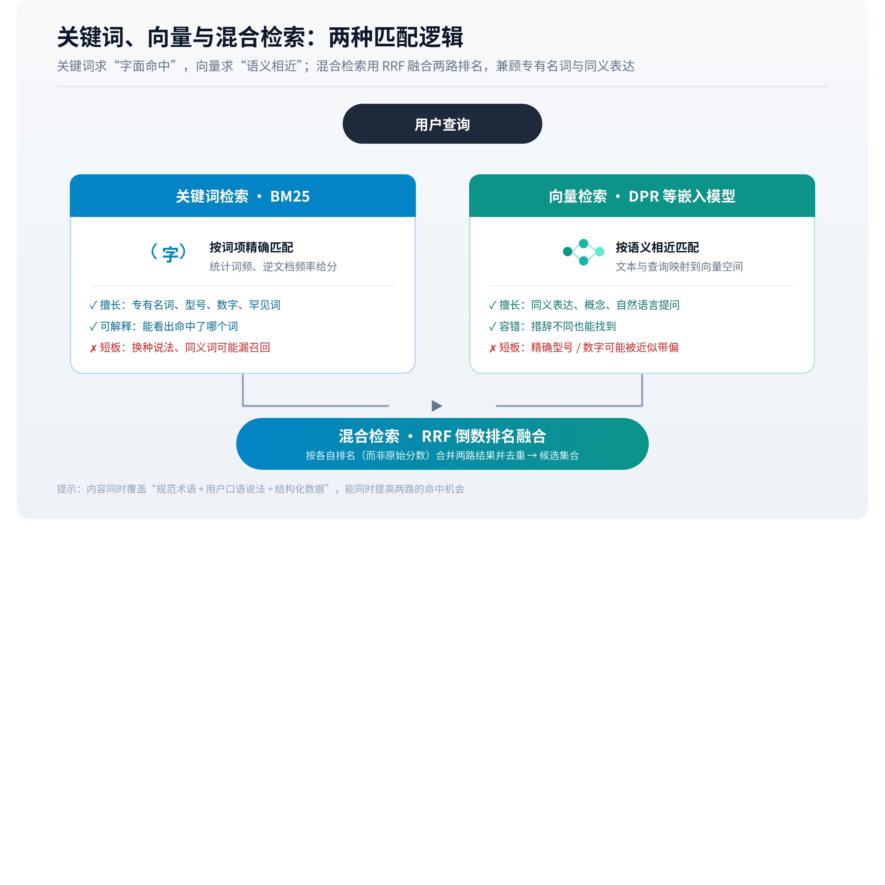

# 关键词、向量与混合检索

文档经过[解析与分块](https://larkcommunity.feishu.cn/wiki/To5TwIwZUisCKmkzm6kcI9x0nRb)后，系统需要从大量候选中选出与问题有关的部分。检索的核心是计算匹配关系，同时控制计算成本。不同表示擅长处理不同类型的匹配，也会遗漏不同类型的信息。

*▲ 机制图解；可交互完整版见[飞书知识库原文](https://larkcommunity.feishu.cn/wiki/Khakwy0Fti51qDkkv5IcWojrnPe)。*

## 一、关键词检索：词项与文档之间的对应

传统词项检索可以通过倒排索引，记录哪些文档包含某个词项。查询到来后，系统从相应列表中找候选，再根据词频、词项区分能力、文档长度等因素评分。BM25 是这类排序方法的代表。斯坦福信息检索教材介绍了其概率检索背景与词频、长度处理。[信息检索教材](https://nlp.stanford.edu/IR-book/html/htmledition/probabilistic-information-retrieval-1.html)

词项方法对具体名称、型号和错误码具有直观优势。用户查询某个报错编号时，编号的准确出现往往十分关键。检索如果只找到“类似错误的处理方法”，可能主题相关却无法解决实际问题。

但同一个意思可以有多种表达。用户问“断网还能操作吗”，资料写“提供离线模式”，表面词项不同。分词、同义词扩展与字段设计能够改善部分差距，但纯词项对应不能天然覆盖所有语义关系。

### 词项分数为什么不等于简单计数

常见词出现在大量文档中，对区分候选的帮助有限；罕见型号或专有名词则可能更有区分力。词频也通常需要控制：一个词出现十次不一定比出现五次多一倍证据。文档越长，偶然包含查询词的机会也越多，因此许多词项排序方法会考虑长度。理解这三种作用，就能看出“堆更多关键词”无法直接等价于更好的匹配。

字段选择还会改变含义。标题、产品型号、正文和标签可以分别建立检索表示；型号字段的精确匹配与正文中的一次提及，可能承担不同功能。具体系统是否设置字段权重、如何设置，需要依据其配置，不能把某种工程习惯当成所有平台统一规则。

中文分词、数字连接符和大小写处理也可能影响精确名称。“AB-120”“AB120”和“AB 120”可能属于同一型号的不同写法，也可能对应不同对象。索引规范化有助于合并表面差异，过度规范化却可能消除区分。专业名称应保留可辨认的原始形式和必要别名，避免在内容表达中制造额外歧义。

## 二、向量检索：把问题和材料映射为可比较表示

向量检索使用模型将文本转换为数值表示，再计算表示之间的相近程度。双编码器可以分别处理问题和文档，文档表示提前保存，查询时只需编码问题并寻找相近候选。DPR 展示了这种方式在开放域问答中的应用。[Dense Passage Retrieval](https://arxiv.org/abs/2004.04906)

这里的“相近”来自模型训练和相似度计算，不能直接解释为事实相同。介绍某项能力、否认该能力和讨论其故障的段落，可能都与问题主题接近。相似性用于寻找值得进一步判断的材料，不能替代否定关系、数值范围和证据支持的检查。

向量表示也不会自动读懂未输入的信息。片段缺少产品版本，向量库无法凭空补齐；训练未充分覆盖某些专业词汇，匹配质量也可能受影响。不同嵌入模型和表示粒度会产生不同候选集合。

### 向量相近到底比较什么

一个向量可以想成模型为文本生成的一组数值坐标，相似度函数衡量这些坐标之间的关系。余弦相似度关注方向，点积还受向量长度影响；采用哪一种，需要与嵌入模型和索引配置一致。这里无需把每个维度解释成某个自然语言概念，单个坐标通常没有“品牌权威度”这样直接可读的含义。

查询和文档可以由不同角色的编码器处理，但需要落到可以比较的表示空间。更换嵌入模型后，旧文档向量与新查询向量通常不能随意混用，即使维度相同也不代表语义空间一致。若只更新一侧，检索质量可能下降，问题不在内容本身。向量化版本与索引版本因此属于重要的系统状态。

语义匹配也受到任务训练影响。一个为问答检索训练的模型，与一个主要衡量一般句子相似度的模型，可能对相同材料给出不同顺序。询问“为什么连接失败”，最有用的材料可能是修复步骤，其表面语言与问题并不特别相似。相关性包含用途关系，无法只由词面或主题接近程度解释。

## 三、近邻搜索与候选数量

在大规模集合中逐一精确比较可能成本较高，系统可以使用近似近邻索引加快查找。近似方法通过一定检索误差换取速度或资源收益。具体参数和数据分布影响取舍，不能仅凭“用了向量数据库”判断召回是否充分。

候选数量通常用 top-k 表示，即返回排序最前的 k 个结果。增加 k 能给后续步骤更多机会，也会引入更多无关片段。最终答案能接收多少材料，还受重排序和上下文预算限制。检索阶段返回更多，不代表生成阶段实际使用更多。

评价检索时，召回关注需要的材料是否被找到，精确程度关注返回集合中有多少相关材料。实际任务还应检查关键证据覆盖：十个主题相似段落，可能仍缺少决定问题的那个版本条件。

一个假设性的小型测试能够说明两种指标的区别：资料集中人工确认有四个相关片段，检索返回五个，其中三个相关。按这组标注计算，精确率为 3/5，召回率为 3/4。若扩大返回数量，第四个相关片段终于出现，同时多出五个无关片段，召回率上升到 100%，精确率却降为 40%。这只是集合层面的计算，实际解释还要检查标注是否完整，以及“相关”是否足够严格。

对于需要同时确认价格、部署方式和适用版本的问题，三个相关片段可能全部在说价格。数量上的召回看起来不错，必要证据仍然缺失。因此，面向回答的检索评价还需要按子问题检查覆盖，并核对片段是否包含完整条件。在开放互联网中，全部相关材料通常不可枚举，所谓召回率必须说明采用了什么已知相关集合；不能将局部测试集上的数值解释成整个互联网的覆盖率。

## 四、混合检索为什么需要融合

词项检索和向量检索可以分别返回候选，再合并排名。它们的原始分数往往具有不同含义和尺度，直接相加需要设计和校准。倒数排名融合 RRF 则根据各列表中的位置形成融合分数，是一种不直接比较原始得分的方式。Azure AI Search 官方文档说明了其混合检索中的 RRF 用法。[混合检索排序](https://learn.microsoft.com/en-us/azure/search/hybrid-search-ranking)

融合并不保证所有任务都改善。精确型号问题可能主要依赖词项通道；语义改述较多的问题可能更受向量通道帮助。多个通道共享同样的资料缺口时，融合也不能找回根本没有进入索引的证据。

元数据过滤还会改变候选范围。例如限定最新版本或某地区，可以排除不适用材料；错误的版本标注却可能把有效材料一起排除。过滤发生的位置及实现会影响效率与覆盖，需要结合具体系统分析。

### 用一个融合例子理解排名与分数

假设词项检索把文档甲排第一、乙排第十，向量检索把甲排第十、乙排第一。若采用对称的倒数排名融合，两篇的贡献和可能相同，因为它们各获得一次第一和一次第十。此时融合表达的是两个通道的相对位置，没有直接使用原始相似度差值。若文档丙在两个通道都排第二，它可能获得更稳定的综合位置。

常见 RRF 形式可以写为：文档得分等于各列表中 `1 / (c + 排名)` 的和，其中 c 是控制排名差距影响的常数。这个常数与“返回多少条结果”的 top-k 属于不同参数。公式帮助理解融合方式，具体服务可能另外设置权重、过滤或截断。不能从它推导出网页作者应重复多少次关键词。

融合前每个通道的候选上限也很重要。某篇材料在两个通道都排在截断之外，融合阶段根本看不到它。重排能力再强，也只能对进入集合的对象处理。检索系统的效果因此取决于表示、召回、截断和融合的组合。

## 五、多向量表示与交互的中间路线

整段压成单个向量比较高效，但可能弱化细粒度词项关系。ColBERT 采用保留多个词项表示、在查询时进行后期交互的设计，探索效率与细粒度匹配之间的取舍。[ColBERT](https://arxiv.org/abs/2004.12832)这提醒我们，关键词检索和单向量检索之外，还存在其他表示方式。

没有必要把这些算法名称直接转成内容写作口令。“向量检索偏好某种字数”“每段必须重复三次实体”等结论，需要额外实验支持。能够从机制中稳妥得到的判断是：明确对象、术语及适用范围，有助于形成可区分的材料；实际检索收益仍依赖所用系统。

## 六、相似度阈值为什么难以跨问题套用

top-k 始终返回固定数量，即使集合中没有真正合适的材料，也可能给出几个相对最像的片段；阈值方式则试图只保留达到某种分数要求的结果。两者解决的问题不同：前者控制数量，后者试图控制最低匹配程度。实际系统可以组合使用，但分数未经过校准时，阈值不应被当成正确概率。

某个查询的最高相似度为 0.8，另一个为 0.6，不能脱离模型、语料和任务断言前者更可靠。问题长度、术语分布和相关材料密度都可能影响分数。跨语言或专业领域变化后，原先经验阈值还可能失效。分数看起来精确，不代表其业务含义已经明确。

检索没有找到足够支持时，应用可以继续寻找、改变查询或保留未知。若系统要求无论如何都输出确定答案，低质量候选很容易成为貌似合理的依据。检索评分与回答决策之间，需要有处理证据不足的环节。

## 七、否定、数值与复合条件为何容易困难

“支持 Windows，不支持 Linux”和“同时支持 Windows 与 Linux”共享大量词项与主题。向量模型可能将它们放得较近，词项检索也可能同时召回。第一阶段能够找到两者并不异常，下一步需要判断否定关系。检索负责提出候选，与验证候选满足条件是连续但不同的任务。

数值比较也有类似问题。“低于十毫秒”“最高十秒”都可能命中延迟相关查询，真正适用与否需要解析单位、测量条件和上下界。若用户要求“预算低于某值且支持某部署方式”，分别满足一项的材料可以语义相关，却无法共同证明同一产品满足全部条件。

因此，高质量检索集合既需要覆盖，也需要提供足以进行细判断的文本。仅返回标题可能有利于快速发现，返回包含限定词的片段才更有利于后续筛选。内容表示的完整性与检索算法的能力共同决定上限。

### 候选过滤与相似度搜索的顺序

设资料库包含一万个片段，其中只有一百个属于用户需要的地区。如果先在全库找最相近的十个，再删除地区不符项，最终可能剩下零个；若先限定地区再检索，则有机会取得该地区最相关的材料。两种流程对候选范围的作用不同，具体系统还会根据索引结构权衡效率。

这个例子说明，空结果未必意味着库里没有相关资料，可能与过滤位置和候选上限有关。同样，过滤字段若记录错误，即使搜索本身准确，也会排除有效内容。检索失败需要同时检查数据标注、查询条件和搜索设置，不能全部归咎于嵌入模型。

过滤还需要考虑缺失值。文档没有地区字段，是适用于全部地区、尚未标注，还是确实不适用？这些状态应根据业务定义处理。把缺失值一律排除可能损失覆盖，一律放行又可能混入不适用资料。元数据质量与检索语义之间因此存在直接联系。

为了判断某次改进是否有效，可以同时报告完整集合的关键证据覆盖与过滤后结果的适用性。如果召回数量增加，却主要增加错误版本，用户任务没有得到相应改善。检索数量只是过程指标，需要结合对象与条件判断。

## 八、检索评估怎样避免看起来很好却无法回答

除了片段级相关标注，还可以设计任务级检查：决定答案的关键事实是否至少有一个可靠来源进入候选，必要条件是否同时出现，反面证据是否被遗漏。对于比较任务，还应检查候选对象是否得到相近深度的资料覆盖。只给一款产品完整手册，另一款只有简介，后续比较天然不对称。

评估集也应包含容易混淆的对象、旧版本和没有答案的问题。若测试只包含名称清楚、资料充分的常见问题，得到的高分未必代表实际复杂场景。未命中有时反映系统正确承认资料缺失；强行返回一个貌似相关的结果，反而可能增加后续错误。

检索完成后，候选通常还要接受更精细的比较。[重排序与候选筛选](https://larkcommunity.feishu.cn/wiki/L7Kyw77LUiAAWEkqqSgcqi4ynKc)将解释为什么进入召回集合，仍然离进入答案有一段距离。

---

*本页同步自 OpenGEO 飞书知识库 · [飞书原文](https://larkcommunity.feishu.cn/wiki/Khakwy0Fti51qDkkv5IcWojrnPe) · 内容以 [CC BY 4.0](https://creativecommons.org/licenses/by/4.0/deed.zh) 开放授权。*
