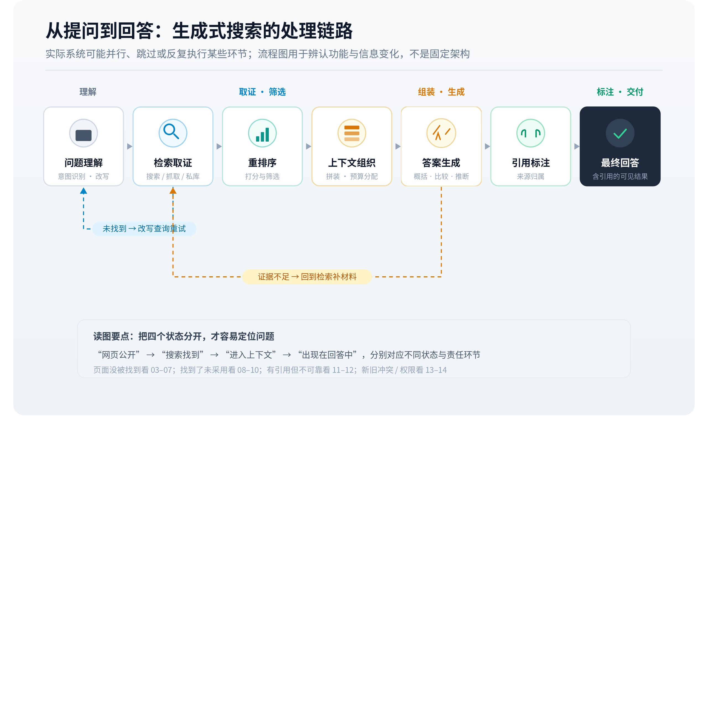

# 从提问到回答：生成式搜索的处理链路

知道[信息来自哪里](https://larkcommunity.feishu.cn/wiki/KgWYwu2qhiOpWlkSeDWc2LSenHd)，还不足以解释最终答案。信息进入系统后，要经过需求理解、候选选择、上下文组织和生成等处理。某个环节改变了对象、范围或条件，即使后面的文字十分流畅，整体结论也可能偏离用户的真实任务。

*▲ 机制图解；可交互完整版见[飞书知识库原文](https://larkcommunity.feishu.cn/wiki/Zuo7w18nKiHCidkpDuScEw1Pnnc)。*

## 一、先区分模型与完整应用

语言模型负责处理输入并生成输出；完整应用还可能包含搜索服务、文件解析器、权限系统、工具调度和引用界面。模型能够提出搜索请求，执行请求的通常是应用或工具服务。工具结果再返回模型，成为下一步处理的输入。

因此，观察一个聊天产品，不能只看它使用了什么模型。相同模型搭配不同检索集合、工具权限、系统指令和上下文配置，可以给出不同回答。一次请求也可能使用多个模型或服务。对外产品名称描述了入口，未必充分描述全部计算过程。

RAG 将检索资料与生成结合，提供了一个基础架构；Self-RAG 则展示了按需检索、生成及评价相结合的研究设计。它们说明系统可以存在多轮信息获取与修正，不能据此断言所有商业应用采用相同模块。[RAG](https://arxiv.org/abs/2005.11401)、[Self-RAG](https://arxiv.org/abs/2310.11511)

## 二、理解任务：系统首先决定需要回答什么

用户的句子往往混合目标、背景、约束和偏好。例如“十个人的团队，预算有限，需要离线使用，选什么工具”，至少包含团队规模、成本和离线能力。系统需要识别哪些是必须满足的条件，哪些可以权衡，并决定是否需要补充信息。

如果离线使用被遗漏，后续检索可能十分准确地找到一组在线工具，但整个回答仍然不适用。这属于任务表示的偏差。它与资料是否可靠、写作是否清晰处于不同环节。反过来，用户本身没有说明地区或版本时，系统可能澄清，也可能自行采用默认条件；默认条件应作为解释结果的变量。

### 从一句话到可执行的任务表示

可以把上面的团队需求展开为一份内部任务表示：对象是协作工具，必须支持离线工作，使用人数为十人，成本需要进一步澄清，输出形式是比较后给出建议。系统未必真的生成这张表，但后续行动要有效，至少需要保留相同的信息关系。用户说“预算有限”没有提供金额，如果直接变成“每人每月低于十元”，就额外引入了未经确认的条件。

任务表示还需要决定答案粒度。用户问“是否支持某功能”，可能只需要一份当前版本的明确说明；用户问“怎样选择”，则需要候选发现、约束筛选和取舍解释；用户问“这个领域主要有哪些争议”，需要覆盖不同观点，单个事实页无法满足。检索与生成质量都依赖这种任务区分。一个面向精确事实的流程，搬到全局综述任务上可能获得很多局部材料，却缺少全局结构。

系统还要判断信息缺口在哪里。已知产品名称而未知版本，下一步通常应寻找版本对应关系；已知功能但未知适用对象，需要补条件；完全没有候选，则先做发现。如果每轮都重新搜索整个问题，可能反复得到同样的介绍，迟迟没有补足关键证据。能够围绕缺口选择下一步行动，是多步问答与简单搜索后摘要的重要差异。

## 三、获取候选：搜索范围先限制了可能答案

完成任务理解后，系统可能调用网页、知识库或业务数据工具。查询有时直接使用用户用语，有时经过改写、拆分或扩展。各查询返回候选材料，再通过过滤、合并和排序缩小集合。

候选集合对结果具有约束：如果某项必要事实没有进入本次可用材料，生成阶段无法仅凭这些材料作出有据判断。当然，模型可能利用参数知识补充信息，但此时需要重新考察时效和来源。回答正确不能倒推出检索已经覆盖了该事实。

2026 年的 SAGEO Arena 将检索、重排序与生成放到共同环境中，发现优化信号在不同阶段可能带来不同表现。其价值在于支持分阶段评价；作者也明确保留了与商业系统专有信号之间的差距。[SAGEO Arena](https://arxiv.org/html/2602.12187v2)

### 多步链路为什么会回到检索

一次检索结束后，系统可能发现材料相互矛盾、缺少决定性条件，或只覆盖了问题的一部分。这时可以改写查询、访问原文、换用另一信息源，或者向用户追问。新增资料又会改变原来的判断。所谓完整链路，因而更适合理解为带状态的循环：当前知道什么、缺什么、下一步用什么工具补足，都影响后续行动。

FLARE 研究尝试在生成过程中根据预期的后续内容决定检索方向；CRAG 则引入检索质量评价，依据结果采取补充获取或处理动作。两者分别体现“生成期间还需要新证据”和“已有检索结果可能不够可靠”的设计思路。[FLARE](https://arxiv.org/abs/2305.06983)、[CRAG](https://arxiv.org/abs/2401.15884)这些研究结构帮助理解主动检索，但无法直接证明某个商业产品使用了相同算法。

循环还需要终止条件。继续搜索会增加时间和成本，而且可能反复找到同源转载，未必减少不确定性。一个合理的终止点可以是主要主张已有足够依据，也可以是关键问题仍无可得证据、应当明确保留未知。界面显示“搜索完成”，只能说明该次流程结束，不能自动说明所有事实都经过穷尽验证。

## 四、组织上下文：从资料集合到模型实际输入

搜索找到的文档未必全部进入上下文。系统可能提取片段、保留摘要、删除重复内容、限制长度，或者补充文档标题和来源编号。这个阶段决定模型实际看到什么，以及各部分以什么关系排列。

假设一份报告前半部分写“适用于企业版”，后半部分列出性能数字。如果系统只取后半段，生成模型收到的事实已经失去版本条件。最终错误虽然在答案中显现，原因可能发生在更早的切分或选取过程。理解这一点，才能避免将所有错误统一归为模型幻觉。

上下文还有容量和成本约束。更多材料可以带来新证据，也会带来重复、冲突及无关信息。系统需要在覆盖程度和处理负担之间安排预算。具体做法在[文档解析](https://larkcommunity.feishu.cn/wiki/To5TwIwZUisCKmkzm6kcI9x0nRb)和[上下文与生成](https://larkcommunity.feishu.cn/wiki/MqtewF3VQivmiCkv2v3cZFGynGe)中展开。

## 五、生成与展示：完整答案还包含新的判断

生成阶段需要把材料组织成直接回答，可能涉及事实比较、条件筛选和语言概括。引用、摘要和建议往往在这个过程中或之后形成。它们可能出现不一致：一句话可以被生成，却缺少可靠来源；一个来源链接可以展示，却没有支持相邻句子的全部含义。

“推荐”还增加了对象选择与偏好权衡。资料说明某产品有什么能力，系统仍需判断这些能力是否适合用户。列出几个名称、解释优缺点和明确给出首选，表达的判断强度不同，需要分别理解。

### 延迟、成本和覆盖怎样共同影响答案

完整应用通常在有限时间内工作。串行步骤的等待时间会相互累积；可以并行的多个查询，又可能受到调用数量和服务速度限制。一个模式只做一次检索，另一个模式允许多次搜索和原文获取，得到不同证据范围在机制上很正常。不能将慢模式增加的全部收益归到某一个模型参数上。

成本也会影响材料选择。全文读取、长上下文处理、交叉编码器重排和多轮验证各自消耗资源。系统可能先用便宜的方法缩小集合，再对少量候选做深入处理。这样可以提高效率，但前一阶段丢失的关键材料，后续精细判断未必能挽回。评价时需要把“候选中没有”和“候选中有但没有采用”分开。

流式输出还会影响答案的形成时机。某些应用可能先给出概述，再展示后续来源或补充内容；另一些应用会等待工具返回后集中生成。界面上文字出现的先后，不足以还原后台各步的严格时序。观察者应优先依据正式工具事件和返回对象，避免仅凭动画或等待提示判断内部架构。

## 六、将链路用于解释，而非猜测内部实现

一张实用的链路图可以写为：任务理解，信息获取，候选筛选，上下文组织，答案生成，引用与界面展示。实际系统可能回到前一步重查资料，也可能跳过搜索直接回答。图中的每个环节代表一种功能，不要求它们都由独立程序实现。

过程记录中的缺失也有两种含义：某一步没有执行，或执行了但未对观察者开放。公开界面通常无法区分二者，因此不能把未显示的步骤一律判定为不存在。相反，应用显示一个“验证完成”标签，也只提供了产品声明；要评价实际核验深度，仍需要知道检查了哪些主张、使用哪些证据及怎样处理分歧。

## 七、一个链路错误怎样逐步放大

继续使用十人团队选择离线协作工具的假设。任务理解保留了“离线”，但查询扩展将它换成了“本地缓存”；召回阶段找回了支持断网查看历史记录的产品；分块时又丢失“无法离线新建”的限制；最终生成将其概括为“支持离线协作”。每一步都只发生一个看似不大的变化，合起来却把只读缓存变成了完整编辑能力。

这类错误不能只通过最后让模型“再仔细一点”稳定解决。若关键限制已经被前面的解析步骤删除，后续模型没有依据恢复原意。只有重新取得完整说明，确认离线究竟覆盖查看、新建、编辑还是同步，才有机会修正。由此可见，答案准确性既受生成约束，也受输入材料完整程度约束。

定位问题时，可以依次比较用户原问题、实际查询、返回片段、模型输入和最终答案。若返回片段已经含有限制而生成漏掉，重点在上下文使用；若原页面有而片段没有，重点在解析和切分；若整个候选集合都缺少该产品的功能页，则回到查询和来源范围。具备哪些过程材料，就能定位到哪些层次。

对于只提供最终答案的公开产品，外部研究通常看不到全部节点。仍然可以记录“离线能力被扩大”这个可验证结果，并提出多个可能解释；要进一步声称是哪一个环节导致，应增加针对性的受控比较。透明地保留替代解释，比给每次波动套上确定的排名规则更有分析价值。

### 环节成功率不能随意相乘

链路看起来像多个步骤串联，容易诱使人把各步骤的平均成功率直接相乘。严格地说，如果定义了同一批任务中的必要事件，联合成功概率可以按条件概率展开；但不同数据集上分别测得的召回率、生成准确率和引用质量，不能直接拼成一个现实系统成功率。指标单位不同、样本不同、事件之间也可能相互依赖。

例如，容易检索的问题往往也容易生成，困难问题则可能同时在多个环节失败。分别报告总体平均值会掩盖这种关联。另一种情况是检索漏掉事实，模型却凭参数知识答对；如果任务评价只检查答案，便看不到检索缺口。链路指标需要根据任务定义，而不能用一个漂亮的乘法公式代替实际测量。

比较系统时，可以先在同一批任务上记录各阶段是否获得必要输入，再核验最终主张。这样能够看出哪类问题集中失败，以及上游修正后下游是否真正改善。对于没有内部过程的产品，可以评价最终质量，但应避免宣称已经测得每个隐藏阶段的准确率。

反事实比较有助于缩小原因：给同一个生成流程换入已经人工确认的完整证据，若答案明显改善，说明原材料供给可能是瓶颈；若仍然遗漏条件，则生成或任务表示值得进一步检查。这类实验需要保留其他设置，结果也只支持该受测环境。

## 八、链路评价为何需要多个指标

检索阶段可以关注关键证据是否返回，生成阶段可以检查事实与条件是否保留，引用阶段可以核对主张和来源是否对应，推荐阶段还要检验是否满足用户约束。这些指标互相影响，但不能互相替代。一个系统可以找全资料却生成错误，也可以依靠参数知识偶然答对而完全漏掉当前证据。

举例来说，十个问题中八次出现品牌名称，描述的是某种出现频率；其中只有三次满足用户约束，才涉及适用性；用户最终是否点击、询价或采用，则需要另外的行为证据。不同阶段都用“效果好”概括，会让问题定位和结果解释失去精度。将指标放回它测量的环节，才能看清改进究竟发生在哪里。

观察时应区分输入证据、过程证据和输出证据。原始资料证明内容存在，工具日志说明本次获取了什么，最终答案说明呈现了什么。三类证据互补，单靠其中一类通常不足以还原全部因果过程。下面先从[信息源范围](https://larkcommunity.feishu.cn/wiki/Tv6Kwh8DriZJmDksS2lcQK9ln9c)展开，再沿链路逐层讨论。

---

*本页同步自 OpenGEO 飞书知识库 · [飞书原文](https://larkcommunity.feishu.cn/wiki/Zuo7w18nKiHCidkpDuScEw1Pnnc) · 内容以 [CC BY 4.0](https://creativecommons.org/licenses/by/4.0/deed.zh) 开放授权。*
