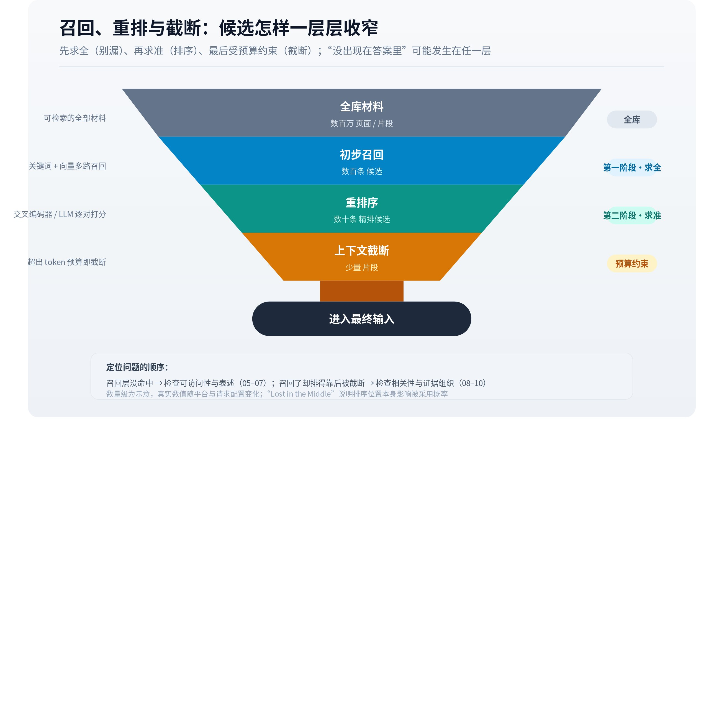

# 重排序与候选筛选

[检索](https://larkcommunity.feishu.cn/wiki/Khakwy0Fti51qDkkv5IcWojrnPe)倾向于从大集合中快速找到候选。重排序面对较小集合，可以投入更多计算，细看问题与材料之间的关系。两者在计算成本和判断精度上承担不同角色，也解释了为什么一个页面已经被找到，却仍未出现在生成上下文中。

*▲ 机制图解；可交互完整版见[飞书知识库原文](https://larkcommunity.feishu.cn/wiki/L7Kyw77LUiAAWEkqqSgcqi4ynKc)。*

## 一、候选排序为什么需要第二次判断

初步召回可能取得几十个与主题相近的片段。其中有些回答了问题，有些只出现相关词，还有一些属于错误版本。进一步比较可以利用更细的语义关系、任务约束或专门评分模型，重新调整顺序。

双编码器先分别编码问题与文档，便于大规模搜索；交叉编码器则把问题和候选放在一起处理，使表示能够直接相互作用，但逐对处理成本更高。Wu 等人发表于 EMNLP 2020 的《Scalable Zero-shot Entity Linking with Dense Entity Retrieval》（BLINK）也采用先检索再精排的两阶段设计，展示了类似的效率与准确性取舍。[BLINK](https://arxiv.org/abs/1911.03814)具体商业搜索可能采用其他模型或多阶段结构，不能据此指定其内部算法。

### 三种排序判断单位

精排可以逐篇评估每个候选与问题的关系，也可以成对比较两篇哪一篇更合适，还可以一次查看一组候选并给出整体顺序。这三类判断常被称为 pointwise、pairwise 和 listwise。它们的成本与误差形式不同：逐篇评分需要保证分数可比较，成对比较需要处理大量组合，整组排序则受到输入长度和位置影响。

例如，甲比乙更相关、乙比丙更相关，并不保证一个不稳定的评判模型每次都会认为甲比丙更相关。成对结果出现循环时，还需要聚合规则。整组排序则可能因候选顺序、材料长度和任务说明变化而改变。工程上需要通过测试判断具体模型的稳定性，而不能把一次排序视为绝对等级。

Sun 等人发表于 EMNLP 2023 的《Is ChatGPT Good at Search? Investigating Large Language Models as Re-Ranking Agents》（RankGPT）将语言模型用于候选重排序，并探索把排序能力迁移到更小模型的方式。[RankGPT](https://arxiv.org/abs/2304.09542)其意义在于展示语言模型可以参与排序任务，而不仅用于最后写答案。研究中的模型、数据集和成本条件，与当前某个商业系统的实现仍应分开。

## 二、相关性至少包含任务和条件

问题是“某产品是否支持 Linux”，介绍该产品设计理念的长文可能主题高度相关，却没有提供操作系统信息。短小的兼容性说明反而可能更直接。重排序需要区分主题接近与回答贡献。

版本条件进一步增加难度。旧版支持 Linux、新版不再支持时，两份说明都与查询相关；若问题询问当前版本，旧说明的回答价值不同。系统需要利用文档内容、元数据或查询条件判断。仅看品牌出现频率，无法完成这种区分。

相关性还不等于可信度。一段虚构但直接回答问题的文字，可以在语义上非常匹配。是否存在证据、来源如何产生、数据是否过时，需要其他判断。不能因为候选排名高，就把它视为已经通过事实验证。

### 排序目标决定什么叫好结果

若目标是回答一个精确日期，直接包含日期及对象的短记录可能最有用；若目标是解释原因，缺少背景的短记录价值有限；若目标是比较路线，需要覆盖不同证据与条件。因此，“相关性”必须相对于任务定义。主题相似只是其中一部分，不能代替回答贡献。

排序模型的训练标签也会塑造它学到的偏好。人工相关性标注、点击行为和最终任务成功率反映不同信号。点击可能受标题吸引力和展示位置影响，不能自动视为事实质量；标注者认为相关，也未必意味着足够支持完整结论。这里讨论的是评价信号的含义，不能据此声称某个未公开平台具体使用了哪些训练数据。

来源质量可以作为额外因素考虑，但通常需要另行定义。资料原始性、时间适用性、方法透明度与查询相关性各自提供不同信息。若把它们压成一个分数，分析者至少需要知道该分数服务什么目标。对外只看到排序结果，无法唯一分解各因素的贡献。

## 三、候选之间也存在关系

独立给每个片段打分，可能让高度相似的材料占据全部前列。它们各自相关，却不能覆盖完整任务。因此，候选选择还可以考虑重复程度与信息互补性，例如保留部署条件、价格条款及性能限制等不同方面。

多样性同样需要边界。为了增加来源数量而加入低质量或不相关页面，可能降低答案质量。不同域名也未必独立，多个片段可能共同转述一份报告。来源和片段的去重，应与任务覆盖一起理解。

合并多个查询的结果还会产生排序取舍。某个子问题得到大量高分材料，可能挤占另一个必要子问题的证据。完整问题包含多个约束时，候选集合的质量需要从整体判断，而不能只看单篇的最高得分。

假设比较三款软件需要确定部署方式、数据导出和费用。候选集合里有六篇高度相似的产品介绍，以及各一篇部署说明、导出说明和价格页。若预算只能容纳四段，单纯按独立相关性取前四段，可能全部来自产品介绍；考虑互补性的选择则有机会保留三项决策信息。这里的区别在于集合提供了多少新增证据，不能只用每段与查询的相似程度解释。

这种选择也会遇到冲突：一份资料覆盖很多问题，但表述含糊；另一份只回答一项，却给出明确版本与限制。具体系统如何平衡覆盖与可靠性，需要看其目标和实现。对外部观察者而言，可以确认某类条件在最终材料中缺失，却不能由此倒推出平台采用了某个固定的多样性系数。

## 四、截断发生在哪里

工具返回数量、重排保留数量和上下文容量都可能限制最终集合。一个页面在搜索列表中排第五，若应用只取前三个，后续模型就可能没有看到它。相反，某个靠后的来源也可能因补充子查询而进入上下文，传统搜索顺序无法直接映射为引用顺序。

SAGEO Arena 将这些阶段放在共同评价中，讨论了正文优化和结构信息在不同环节的表现差异。[SAGEO Arena](https://arxiv.org/html/2602.12187v2)它为“分阶段测量”提供证据，而非提供可直接套用到所有引擎的固定排名公式。

如果只观察最终答案，无法判断某页面在候选列表中的位置。没有引用可能是未召回、重排后丢弃、上下文截断，也可能是生成时未使用。需要工具日志或受控实验才能进一步定位。

### 长度和去重怎样改变保留集合

候选按篇排序与按片段排序会产生不同结果。一个长报告含有很多相关片段，可能在候选中占据多处位置；另一份独立短报告只有一个片段。若不区分来源身份，前者可能挤占上下文，形成数量上的优势，却没有增加等量的新证据。去重需要考虑内容重叠，也要考虑多个片段是否共同提供必要条件。

完全删除同源片段也未必合理。一份报告的主结论、方法和限制可能分布在不同位置，保留其中三段能够构成更完整证据。去重的目标应是减少无新增信息的重复，同时保留支持判断所需的互补内容。简单按域名只留一条，可能损害完整性。

上下文预算还可能按 token 限制。几篇篇幅较长的高分材料会消耗更多预算，系统可能截取、压缩或选择更短候选。最终保留顺序因而受到相关性与成本共同影响。这并不能推出短网页必然有优势，因为长材料也可能通过片段级检索进入答案。

## 五、模型评分也可能受呈现方式影响

使用语言模型进行比较或评分时，输入顺序与呈现格式可能影响判断。关于语言模型评价偏差的研究，在其受测任务中观察到候选顺序对评分的影响。[Large Language Models are not Fair Evaluators](https://arxiv.org/abs/2305.17926)这一发现提示实验中应控制位置，不能直接推断某个商业平台的重排器具有相同偏差和幅度。

重排序结果最好被理解为特定目标与配置下的选择，而非文档的永久等级。查询改变、候选改变、模型改变，排序也可能变化。对 GEO 而言，专业分析应追问材料为哪个任务提供了什么贡献，以及它在当前流程中能否保留。脱离问题和配置，无法给文档赋予统一的“AI 权重”。

## 六、排序质量应怎样测量

只检查第一名是否相关，适合部分单一事实任务，却无法覆盖需要多项证据的问题。评估可以关注前若干位的相关程度，也可以区分“略微相关”“直接回答”“完整支持”等等级，并让靠前位置获得更高权重。常见的折损累计增益类指标体现了这种思想：高质量材料靠前比靠后更有价值，但具体标注和折损方式需要说明。

这类指标衡量列表质量，最终回答质量仍需单独测量。高分列表可能缺少一项否定条件，也可能把多个互相矛盾的来源排在前列。若生成阶段能正确识别冲突，答案仍可能可靠；若忽略冲突，则排名再好也没有完成任务。评价应避免把检索指标直接当作用户决策效果。

对线上产品的外部观察而言，引用顺序通常无法替代精排结果。应用可能只展示被使用的来源，按文字出现先后排序，或合并同一站点。没有内部列表，就不能从卡片第一位精确计算重排指标。可见输出的指标应使用相应名称，避免假装测到了不可见环节。

### 排名分数的尺度与校准

重排器给出一个数值时，应先知道它表达什么。可能是任意尺度的相关性得分，也可能是某个类别的模型输出，只有经过相应校准和验证，才有依据解释为概率。分数为八十分，不能自然翻译成“这篇文章有八成可能真实”或“八成可能被引用”。

不同查询下的分数也未必可以直接比较。一个明确型号问题的最高分，与一个宽泛行业综述的最高分，受到输入和候选集合影响。某些系统还会在当前列表内归一化，使分数更便于排序，但失去跨列表的直接可比性。分析平台日志时，字段名称叫 score 并不足以说明其业务含义。

排名指标同样依赖标注集合。斯坦福信息检索教材讨论了精确率、平均精确率等排序评价方法及其适用条件。[排序结果评价](https://nlp.stanford.edu/IR-book/html/htmledition/evaluation-of-ranked-retrieval-results-1.html)这些指标能帮助比较同一测试条件下的列表，却不能自动评价来源是否真实、答案是否有据。

假设两套列表都把一个相关片段放在首位，但其中一套还覆盖了版本限制，另一套没有。只看首个命中的位置，两者可以得分相同；评价完整回答所需证据，结果却不同。指标选择需要贴近任务，否则排序改进可能只在数字上成立，而没有解决读者的实际问题。

## 七、怎样区分内容效果与候选集合变化

假设修改一篇技术说明后，它在回答中出现更频繁。可能的解释包括新文字更匹配查询、索引更新、竞争页面暂时不可用、平台模型更换，或者测试问题本身更偏向该文档。仅有前后对比，无法唯一确定是精排更喜欢了新内容。

在可控检索系统中，可以固定候选集合，比较同一问题下原版与新版的排序，再单独比较生成采用情况。这样有助于分开表示、排序和生成三个作用。对无法固定内部状态的平台，则应使用重复观测、相近对照及时间记录，结论仍需保留可能的混杂因素。

专业的机制解释应能够说明变化在哪一层有证据。若只观察到最终提及增加，就将结论限定于提及；若同时取得候选列表及分数变化，才有更多依据讨论重排。证据层级越清楚，越不容易将巧合写成长期规则。

### 一个关键限制如何改变候选价值

假设两份材料都介绍同一产品，一份宣传页反复说明“高性能”，另一份兼容性页明确写“当前系统版本不支持”。对于用户的兼容性问题，后者提供了决定性信息，即使篇幅短、措辞朴素。若任务换成了解产品定位，宣传页又可能更相关。材料价值随任务改变，固定的文档等级无法完整描述这种关系。

重排之后仍需维护这项限制。即使正确把兼容性页放在前列，生成时若只保留优点，最终答案仍然失败。阶段划分有助于定位责任：排序让证据有机会被使用，生成需要实际遵守证据。把两者共同压成一个排名分数，会失去这项区别。

## 八、从相关材料到可用证据仍需身份连接

重排序可以把谈论某名称的材料推到前列，但名称对应哪个实体，还需要确认。两家同名公司、同一品牌不同地区的产品线、旧版与新版兼容性，都可能在语义上高度相近。[下一篇讨论的实体消歧](https://larkcommunity.feishu.cn/wiki/RmeEwm9CYisjKYk8UdwccXpFnzh)负责维持这些身份边界。排序负责优先处理什么，事实归属负责确认处理的到底是谁。

---

*本页同步自 OpenGEO 飞书知识库 · [飞书原文](https://larkcommunity.feishu.cn/wiki/L7Kyw77LUiAAWEkqqSgcqi4ynKc) · 内容以 [CC BY 4.0](https://creativecommons.org/licenses/by/4.0/deed.zh) 开放授权。*
