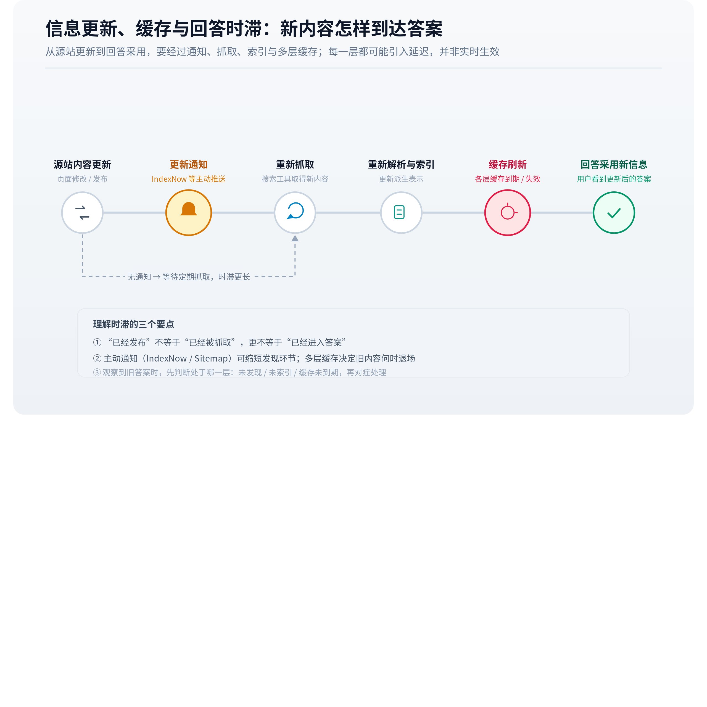

# 信息更新、缓存与回答时滞

网页已经修改，回答仍然沿用旧信息，是机制分析中常见的问题。它可能涉及参数知识、索引、缓存、第三方转载和本次资料选择。只有把不同时间分开，才能判断究竟是哪一个环节尚未反映变化。

## 一、一个事实对应多个时间

至少需要区分事实生效时间、原始资料更新时间、搜索服务取得材料的时间，以及回答生成时间。产品规则在月初生效，官网几天后修改，其他介绍又晚一些更新，四个时间可能并不接近。

页面显示的发布日期也有不同含义。一篇旧报告在新网站重新发布，页面日期较新，报告描述的对象却仍属于过去；一份长期维护的技术文档可能没有醒目的新发布日期，却已经更新了功能说明。评价时效应看事实有效期与版本，而非只选最近的日期。

这一问题与[实体和版本归属](https://larkcommunity.feishu.cn/wiki/RmeEwm9CYisjKYk8UdwccXpFnzh)相连。旧资料可以正确回答历史问题，错误发生在把它用于不匹配的当前问题。时间条件是主张的一部分，不能单纯视为附加装饰。

### 事实时间与记录时间的区别

一项政策今天公布，下个月生效；一份报告今年发布，统计的是去年数据。公布时间和事实有效时间不同，回答“现在是什么情况”时，需要依据后者。新网页可能描述旧事实，旧页面也可能通过持续维护提供当前有效信息。日期越多，越需要明确每个日期指向什么事件。

数据库中还可能分别保存业务生效时间与系统记录时间。某个价格追溯至月初生效，但系统月中才录入，这两条时间线可以同时成立。用户问“月初实际适用什么价格”和“月初系统显示什么价格”，需要不同答案。生成系统若只保留一个更新时间字段，就可能无法正确区分。

时间表达本身也会过期。“目前支持”“今年推出”在原始发布时有明确含义，经过转载或片段检索后却可能失去参照日期。把相对时间解释为回答当天，会让历史资料显得异常新。保留来源日期与实际有效期，是防止这种漂移的重要条件。

## 二、更新通知与实际索引变化

搜索服务通常需要重新取得并处理变化的内容。网站可以通过相应机制通知服务存在新增、更新或删除，但通知接收不等于完成索引，更不等于最终答案已改变。IndexNow 的官方说明将其定位为向参与服务通知 URL 变化，并保留是否抓取与索引等后续判断。[IndexNow FAQ](https://www.indexnow.org/faq)

因此，“提交成功”证明的是通知环节完成到某一步。若要确认新内容已被使用，还需观察检索结果或实际返回材料。把通知接口的成功状态直接解释为 GEO 效果，会跳过多个处理环节。

删除也有时间差。源站删除页面后，旧索引、摘要或其他网站转载可能继续存在。看到旧说法，不能仅凭结果确认系统仍在访问已删除的源站。

## 三、缓存为什么影响新鲜度

缓存保存此前取得或计算的结果，可以减少重复请求和延迟。网页获取、搜索服务和应用内部都可能存在缓存，但具体层次需要按公开实现或日志确认，不能假定所有系统结构相同。

Gemini 的 URL Context 说明了先利用内部索引缓存、必要时再实时获取的路径。[官方说明](https://ai.google.dev/gemini-api/docs/url-context)这为“提供 URL 未必每次直接访问源站”给出一个明确实例。用户访问到新页面与工具取得旧表示，可以同时发生。

应用也可能保存对话中的旧材料。即使网页已更新，当前会话仍围绕早先获取的片段回答；重新搜索和在原上下文继续生成，行为不同。若要判断更新问题，必须记录本次是否实际获取了新资料。

### 缓存至少要分清保存的对象

网络层缓存可能保存网页响应，搜索层保存索引或摘要，应用层可能保存工具结果或之前生成的答案。三者失效和更新方式不同。浏览器刷新网页，只能影响当前访问路径，不能自动清空搜索服务及其他应用中的副本。用户看到最新内容，后台工具仍取得旧内容，在多层系统中完全可能发生。

HTTP 缓存协议定义了有效期、重新验证与存储控制等机制。以常见指令为例，no-cache 通常要求再次使用前进行验证，no-store 则限制存储；二者含义不同。[RFC 9111](https://www.rfc-editor.org/rfc/rfc9111.html)这些规则适用于相应 HTTP 缓存行为，不能直接决定模型参数、搜索索引或应用自建知识库怎样更新。

提示词缓存还需要另外区分。某些模型服务复用重复输入的计算以降低处理成本，其对象是计算状态；这不等于应用直接返回上一次生成的答案。看到“缓存命中”时，应先确认命中的究竟是网页、检索结果、完整回答还是输入计算。不同对象导致的不新鲜问题不能用同一个原因解释。

缓存键决定哪些请求被视为相同。若结果与用户身份、地区、语言或产品版本相关，这些条件就影响复用是否恰当。忽略条件可能把一个用户或地区的资料错误用于另一个场景。这里既涉及时效，也涉及第十四篇讨论的权限边界。

## 四、新旧来源竞争与冲突

新资料可访问，仍可能没有成为本次主要依据。旧介绍的搜索匹配更强、转载更多，或者更符合当前查询，就可能继续进入候选。最终生成还可能受到参数知识或前文旧材料影响。

[上下文冲突研究](https://arxiv.org/abs/2404.16032)说明，外部内容与模型既有知识发生分歧时，处理并非天然可靠。对具体平台，应通过实际引用和材料状态分析，不能把所有旧答案解释为训练截止日期造成的结果。

冲突还可能是真实口径差异。总部官网公布新政策，某地区仍处于过渡期；产品主版本更新，旧部署暂未升级。答案应确认用户所在的适用范围，不能简单选择新旧材料中的一方。

### 删除、撤回与更正的传播路径不同

删除原页面只能直接改变源站状态，不能保证其他站点同步删除转述，更不能让已经保存的历史答案自动消失。撤回一份报告还需要让后续使用者知道原结论不再成立；若只移除文件而没有更正说明，检索到旧引用的系统可能缺少理解撤回原因的材料。

更正通常需要表达旧结论哪里发生变化。例如“参数从二十改为十二”应保留对象、版本和更正时间，让系统能够识别新旧值的关系。只发布一篇新的泛泛介绍，旧的具体参数仍可能更容易匹配查询。更正材料的存在与被本次采用，是两个继续需要分别确认的状态。

对于合法保存的历史材料，旧状态本身可能仍有价值。研究某产品过去的能力，需要知道当时的文档写了什么。更新体系应同时支持当前事实与历史追溯，避免把所有旧记录都视为应当抹去的错误。生成答案则需要明确当前问题属于哪种时间范围。

## 五、怎样解释观察到的时滞

假设某项功能在 9 月 1 日生效，官网 9 月 3 日更新，9 月 10 日首次观察到正确回答。可以确认这几个事件的顺序，却不能由此推定平台固定需要七天更新。此前可能已在其他问题中使用新信息，也可能本次才检索到相应页面。

只观察到“第一次出现”，还要考虑测试频率。每周测试一次与每天测试一次，首次观测日期不同。没有持续记录时，精确时滞不可直接得知。重复提问也会受到查询、会话和平台版本影响，不能把波动都归给更新进度。

比较更新时间时，宜保留新旧原文、适用条件、查询、返回材料和引用状态。能够确认的阶段单独报告，不能确认的环节保留未知。这样的记录有助于区分发布滞后、获取滞后和采用滞后。

## 六、新鲜度需要与证据质量共同判断

时效敏感的问题，如价格、服务范围和版本能力，需要优先核对当前有效信息；历史原始研究则可能仍是某个结论最直接的依据。新文章如果只是转述旧研究，并没有自动增加新的实证。

可靠的时间判断因此包含两问：这份材料描述何时的事实，它是否适用于当前问题。单纯刷新日期、重复发布或频繁改写，无法替代这两项判断，也不能保证系统更快采用。

## 七、从发布到回答变化的一条时间线

*▲ 机制图解；可交互完整版见[飞书知识库原文](https://larkcommunity.feishu.cn/wiki/XuCFwc5CZieyD4kAe75cYPPOnHb)。*

假设某软件在 9 月 1 日取消基础版的一项功能，官网 9 月 2 日更新，9 月 4 日搜索摘要仍显示旧说明，9 月 6 日工具能够取得新版正文，9 月 8 日某次回答终于给出正确结论。能够观察到的是这些具体事件，不能把相邻日期差直接认定为内部各环节的真实处理时长。

因为 9 月 6 日首次取得新版，不代表 9 月 5 日平台必然没有新版；9 月 8 日首次回答正确，也不代表此前没有其他问题得到正确回答。测试频率、查询形式和会话条件都会影响首次观测。若前一次已确认旧状态、后一次确认新状态，可以给出变化发生的观测区间，比单一精确时长更符合证据。

进一步定位需要比较返回材料。如果工具已经提供新正文，答案仍沿用旧说法，问题更接近材料采用、冲突处理或会话状态；若工具仅返回旧摘要，则应继续查看获取与索引；若引用第三方旧介绍，说明来源选择也参与了结果。网页更新可以通过多个信息入口传播，各入口具有不同的处理进度和同步条件。

## 八、更新敏感度与问题类型有关

天气、库存和价格通常需要近期状态；历史事件的原始日期不会因为今天有新文章而改变；科学研究的后续证据可能修正解释，却不改变某篇论文当时实际报告的结果。统一要求“越新越好”，会把这些任务混为一谈。

对版本功能，关键是用户所用版本；对地区服务，关键是当地生效范围；对长期事实，关键是是否出现更正或反证。新鲜度因而是一种与任务相关的适用性。发布时间可以帮助筛选，无法独立承担最终判断。

FreshQA 将快速变化的世界知识与错误前提纳入问答测试，为时间敏感评价提供了一个研究实例。[FreshLLMs](https://arxiv.org/abs/2310.03214)引用这类研究时，应关注它如何定义动态问题和评价任务，避免把某个历史实验得分当作今天所有平台的时效排名。

### 重算、重新索引与失效传播

源文档改变后，系统可能需要重新解析、生成片段、更新向量、替换摘要，并移除过期表示。只更新其中一个环节，可能让系统处于混合状态：关键词索引已包含新值，向量检索仍返回旧片段，缓存摘要又保留旧结论。实际架构是否存在这些层次，需要过程证据确认，但多份派生表示不同步是分析时应考虑的可能路径。

局部修改还会影响引用坐标。文档增加一段后，页码或片段顺序改变；若引用继续使用旧位置，就可能指向不相关内容。版本化可以帮助保留当时证据，但需要在当前回答中明确使用哪个版本。仅有一个始终变化的通用 URL，很难独立复现历史结论。

判断更新完成，可以分别定义几个状态：源站已经更正，工具取得更正后正文，可检索集合反映变化，答案保留了新条件。它们不一定按单一直线依次出现，例如指定 URL 获取可以先于搜索索引更新。观测结果应按实际路径描述，避免把某一条路径的成功当作全部入口同步成功。

对内容维护来说，稳定的版本标识、清楚的生效时间和可辨认的更正关系，有助于下游判断。这些信息提高的是解释条件的完整程度，不能保证平台立即刷新。刷新速度还取决于服务调度、索引处理和当前查询，属于需要持续观察的系统行为。

时间观测还需要统一时区和日期粒度。公告使用当地日期，抓取日志使用 UTC，报告只记到日，直接相减可能制造不存在的先后差异。对于只具有日期级记录的资料，应以相应粒度描述；只有取得足够精确且含义一致的时间戳，才适合讨论小时级甚至分钟级时滞。测量精度不能高于原始记录。

## 九、一次修正何时可以称为稳定变化

连续几次正确回答，比单次结果提供更多观察，但仍需要说明问题集合和时间范围。如果只反复测试同一句话，可能测到特定会话或查询的行为；加入同义问法、历史问题和版本区分，才能看到修正是否覆盖相关语义范围。测试还应区分“事实被纠正”和“引用换成新页面”，两者并不总是同步。

稳定性也不意味着永远不变。来源更新、模型升级和检索配置调整后，答案可能再次变化。对机制研究而言，合理目标是在明确范围内识别当前状态和变化趋势，保存足够证据用于复核。一个可追溯的时间记录，比承诺某平台固定几天更新更有长期价值。

---

*本页同步自 OpenGEO 飞书知识库 · [飞书原文](https://larkcommunity.feishu.cn/wiki/XuCFwc5CZieyD4kAe75cYPPOnHb) · 内容以 [CC BY 4.0](https://creativecommons.org/licenses/by/4.0/deed.zh) 开放授权。*
